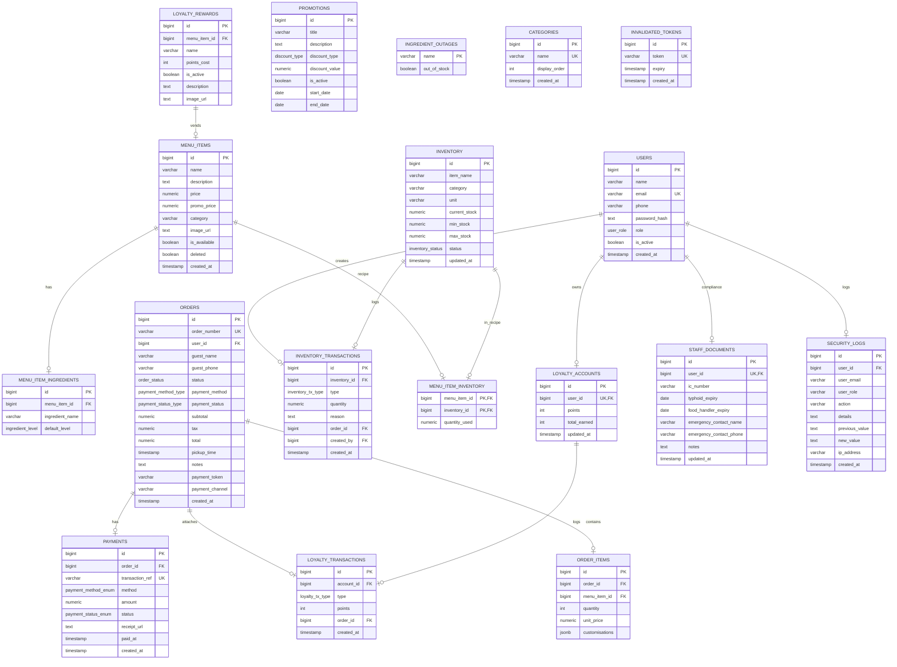

# Database Documentation — BKB System

## Document Control
| Version | Date | Author | Description |
|---|---|---|---|
| v1.0.0 | 2026-06-14 | Antigravity AI | Initial production database schema mapping. |

---

## 1. Database Overview
The BKB platform utilizes **PostgreSQL** as its core relational database system. Database schemas are updated sequentially via **Flyway** migration scripts loaded during backend startup.

* **Database Engine**: PostgreSQL 16 or 17.
* **Driver**: `org.postgresql.Driver` with Hikari Connection Pool.
* **Flyway Target Location**: `db/migration`.
* **Primary Key Strategy**: Auto-incrementing sequences (`BIGSERIAL`).
* **Timestamp Standard**: `TIMESTAMP WITHOUT TIME ZONE` defaults to `NOW()`, synchronized to local environment JVM times.

---

## 2. Entity-Relationship Diagram (ERD)



---

## 3. Table Definitions

### 3.1 `users`
Stores user records for all roles.
* `id` (BIGINT, PK, Auto-Increment)
* `name` (VARCHAR(100), NOT NULL)
* `email` (VARCHAR(150), UNIQUE, NOT NULL)
* `phone` (VARCHAR(20))
* `password_hash` (TEXT, NOT NULL)
* `role` (user_role enum: 'CUSTOMER', 'STAFF', 'MANAGER', 'GUEST', 'ADMIN', DEFAULT 'CUSTOMER')
* `is_active` (BOOLEAN, DEFAULT TRUE)
* `created_at` (TIMESTAMP, DEFAULT NOW())

### 3.2 `menu_items`
Stores the active products sold by the shop.
* `id` (BIGINT, PK, Auto-Increment)
* `name` (VARCHAR(150), NOT NULL)
* `description` (TEXT)
* `price` (NUMERIC(10,2), NOT NULL, CHECK >= 0)
* `promo_price` (NUMERIC(10,2), CHECK >= 0)
* `category` (VARCHAR(80))
* `image_url` (TEXT)
* `is_available` (BOOLEAN, DEFAULT TRUE)
* `deleted` (BOOLEAN, NOT NULL, DEFAULT FALSE)
* `created_at` (TIMESTAMP, DEFAULT NOW())

### 3.3 `menu_item_ingredients`
Configures default customization slots for menu items.
* `id` (BIGINT, PK, Auto-Increment)
* `menu_item_id` (BIGINT, FK referencing `menu_items(id)` ON DELETE CASCADE)
* `ingredient_name` (VARCHAR(100), NOT NULL)
* `default_level` (ingredient_level enum: 'NONE', 'LESS', 'MEDIUM', 'EXTRA', DEFAULT 'MEDIUM')

### 3.4 `orders`
Stores order records.
* `id` (BIGINT, PK, Auto-Increment)
* `order_number` (VARCHAR(20), UNIQUE, NOT NULL)
* `user_id` (BIGINT, FK referencing `users(id)` ON DELETE SET NULL)
* `guest_name` (VARCHAR(100))
* `guest_phone` (VARCHAR(20))
* `status` (order_status enum: 'PENDING', 'ACCEPTED', 'GRILLING', 'ASSEMBLING', 'READY', 'COMPLETED', 'CANCELLED', DEFAULT 'PENDING')
* `payment_method` (payment_method_type enum: 'ONLINE', 'CASH', DEFAULT 'CASH')
* `payment_status` (payment_status_type enum: 'UNPAID', 'PAID', 'FAILED', DEFAULT 'UNPAID')
* `subtotal` (NUMERIC(10,2), NOT NULL, DEFAULT 0)
* `tax` (NUMERIC(10,2), NOT NULL, DEFAULT 0)
* `total` (NUMERIC(10,2), NOT NULL, DEFAULT 0)
* `pickup_time` (TIMESTAMP)
* `notes` (TEXT)
* `payment_token` (VARCHAR(100))
* `payment_channel` (VARCHAR(50))
* `created_at` (TIMESTAMP, DEFAULT NOW())

### 3.5 `order_items`
Detail lines of items ordered.
* `id` (BIGINT, PK, Auto-Increment)
* `order_id` (BIGINT, FK referencing `orders(id)` ON DELETE CASCADE)
* `menu_item_id` (BIGINT, FK referencing `menu_items(id)` ON DELETE SET NULL)
* `quantity` (INT, NOT NULL, CHECK > 0)
* `unit_price` (NUMERIC(10,2), NOT NULL, CHECK >= 0)
* `customisations` (JSONB, DEFAULT '[]')

### 3.6 `payments`
Tracks transactions generated per order.
* `id` (BIGINT, PK, Auto-Increment)
* `order_id` (BIGINT, FK referencing `orders(id)` ON DELETE CASCADE)
* `transaction_ref` (VARCHAR(100), UNIQUE)
* `method` (payment_method_enum: 'FPX', 'CASH', DEFAULT 'CASH')
* `amount` (NUMERIC(10,2), NOT NULL, CHECK >= 0)
* `status` (payment_status_enum: 'PENDING', 'SUCCESS', 'FAILED', DEFAULT 'PENDING')
* `receipt_url` (TEXT)
* `paid_at` (TIMESTAMP)
* `created_at` (TIMESTAMP, DEFAULT NOW())

### 3.7 `inventory`
Raw ingredient inventory configurations.
* `id` (BIGINT, PK, Auto-Increment)
* `item_name` (VARCHAR(150), NOT NULL)
* `category` (VARCHAR(80))
* `unit` (VARCHAR(30))
* `current_stock` (NUMERIC(10,2), NOT NULL, CHECK >= 0)
* `min_stock` (NUMERIC(10,2), NOT NULL, CHECK >= 0)
* `max_stock` (NUMERIC(10,2), NOT NULL, CHECK >= 0)
* `status` (inventory_status: 'GOOD', 'LOW', 'CRITICAL', DEFAULT 'GOOD')
* `updated_at` (TIMESTAMP, DEFAULT NOW())

### 3.8 `inventory_transactions`
Auditable changes to stock levels.
* `id` (BIGINT, PK, Auto-Increment)
* `inventory_id` (BIGINT, FK referencing `inventory(id)` ON DELETE CASCADE)
* `type` (inventory_tx_type enum: 'DEDUCT', 'RESTOCK', 'WASTE', 'ADJUST')
* `quantity` (NUMERIC(10,2), NOT NULL)
* `reason` (TEXT)
* `order_id` (BIGINT, FK referencing `orders(id)` ON DELETE SET NULL)
* `created_by` (BIGINT, FK referencing `users(id)` ON DELETE SET NULL)
* `created_at` (TIMESTAMP, DEFAULT NOW())

### 3.9 `menu_item_inventory`
Recipe mapping configuration connecting Menu items to raw stock units.
* `menu_item_id` (BIGINT, PK, FK referencing `menu_items(id)` ON DELETE CASCADE)
* `inventory_id` (BIGINT, PK, FK referencing `inventory(id)` ON DELETE CASCADE)
* `quantity_used` (NUMERIC(10,2), NOT NULL, CHECK > 0)

### 3.10 `loyalty_accounts`
Points totals for registered users.
* `id` (BIGINT, PK, Auto-Increment)
* `user_id` (BIGINT, UNIQUE, FK referencing `users(id)` ON DELETE CASCADE)
* `points` (INT, NOT NULL, DEFAULT 0, CHECK >= 0)
* `total_earned` (INT, NOT NULL, DEFAULT 0)
* `updated_at` (TIMESTAMP, DEFAULT NOW())

### 3.11 `loyalty_rewards`
Offers purchasable with loyalty points.
* `id` (BIGINT, PK, Auto-Increment)
* `menu_item_id` (BIGINT, FK referencing `menu_items(id)` ON DELETE SET NULL)
* `name` (VARCHAR(150), NOT NULL)
* `points_cost` (INT, NOT NULL, CHECK > 0)
* `is_active` (BOOLEAN, DEFAULT TRUE)
* `description` (TEXT)
* `image_url` (TEXT)

### 3.12 `loyalty_transactions`
Points adjustments records.
* `id` (BIGINT, PK, Auto-Increment)
* `account_id` (BIGINT, FK referencing `loyalty_accounts(id)` ON DELETE CASCADE)
* `type` (loyalty_tx_type: 'EARN', 'REDEEM')
* `points` (INT, NOT NULL)
* `order_id` (BIGINT, FK referencing `orders(id)` ON DELETE SET NULL)
* `created_at` (TIMESTAMP, DEFAULT NOW())

### 3.13 `promotions`
Discount periods.
* `id` (BIGINT, PK, Auto-Increment)
* `title` (VARCHAR(200))
* `description` (TEXT)
* `discount_type` (discount_type: 'PERCENT', 'FIXED', DEFAULT 'PERCENT')
* `discount_value` (NUMERIC(10,2), NOT NULL, CHECK >= 0)
* `is_active` (BOOLEAN, DEFAULT TRUE)
* `start_date` (DATE)
* `end_date` (DATE)

### 3.14 `ingredient_outages`
Out of stock toggles.
* `name` (VARCHAR(100), PK)
* `out_of_stock` (BOOLEAN, NOT NULL, DEFAULT FALSE)

### 3.15 `categories`
Display categories.
* `id` (BIGINT, PK, Auto-Increment)
* `name` (VARCHAR(100), UNIQUE, NOT NULL)
* `display_order` (INT, NOT NULL, DEFAULT 0)
* `created_at` (TIMESTAMP, DEFAULT NOW())

### 3.16 `staff_documents`
Safety documents.
* `id` (BIGINT, PK, Auto-Increment)
* `user_id` (BIGINT, UNIQUE, FK referencing `users(id)` ON DELETE CASCADE)
* `ic_number` (VARCHAR(20))
* `typhoid_expiry` (DATE)
* `food_handler_expiry` (DATE)
* `emergency_contact_name` (VARCHAR(100))
* `emergency_contact_phone` (VARCHAR(20))
* `notes` (TEXT)
* `updated_at` (TIMESTAMP, DEFAULT NOW())

### 3.17 `invalidated_tokens`
Logged out JWT strings.
* `id` (BIGINT, PK, Auto-Increment)
* `token` (VARCHAR(1000), UNIQUE, NOT NULL)
* `expiry` (TIMESTAMP, NOT NULL)
* `created_at` (TIMESTAMP, DEFAULT NOW())

### 3.18 `security_logs`
Audit trails.
* `id` (BIGINT, PK, Auto-Increment)
* `user_id` (BIGINT, FK referencing `users(id)` ON DELETE SET NULL)
* `user_email` (VARCHAR(150))
* `user_role` (VARCHAR(50))
* `action` (VARCHAR(255), NOT NULL)
* `details` (TEXT)
* `previous_value` (TEXT)
* `new_value` (TEXT)
* `ip_address` (VARCHAR(50))
* `created_at` (TIMESTAMP, DEFAULT NOW())

---

## 4. Indexes
Enforced to speed up searches on highly frequented fields:
* `idx_users_email` on `users(email)`
* `idx_users_role` on `users(role)`
* `idx_menu_items_category` on `menu_items(category)`
* `idx_menu_items_available` on `menu_items(is_available)`
* `idx_mii_menu_item` on `menu_item_ingredients(menu_item_id)`
* `idx_orders_user_id` on `orders(user_id)`
* `idx_orders_status` on `orders(status)`
* `idx_orders_created_at` on `orders(created_at)`
* `idx_orders_order_number` on `orders(order_number)`
* `idx_order_items_order_id` on `order_items(order_id)`
* `idx_order_items_menu_item_id` on `order_items(menu_item_id)`
* `idx_payments_order_id` on `payments(order_id)`
* `idx_payments_status` on `payments(status)`
* `idx_inventory_status` on `inventory(status)`
* `idx_inventory_category` on `inventory(category)`
* `idx_inv_tx_inventory_id` on `inventory_transactions(inventory_id)`
* `idx_inv_tx_order_id` on `inventory_transactions(order_id)`
* `idx_inv_tx_created_at` on `inventory_transactions(created_at)`
* `idx_loyalty_tx_account_id` on `loyalty_transactions(account_id)`
* `idx_loyalty_tx_order_id` on `loyalty_transactions(order_id)`
* `idx_promotions_active` on `promotions(is_active)`
* `idx_staff_docs_user` on `staff_documents(user_id)` (Unique Index)
* `idx_invalidated_tokens_token` on `invalidated_tokens(token)`
* `idx_security_logs_user_id` on `security_logs(user_id)`
* `idx_security_logs_action` on `security_logs(action)`
* `idx_security_logs_created_at` on `security_logs(created_at)`

---

## 5. Triggers & Stored Procedures

### 5.1 PL/pgSQL Function: `update_inventory_status()`
Evaluates stock level categories on inventory changes.
```sql
CREATE OR REPLACE FUNCTION update_inventory_status()
RETURNS TRIGGER AS $$
BEGIN
    IF NEW.current_stock <= NEW.min_stock * 0.5 THEN
        NEW.status := 'CRITICAL';
    ELSIF NEW.current_stock <= NEW.min_stock THEN
        NEW.status := 'LOW';
    ELSE
        NEW.status := 'GOOD';
    END IF;
    NEW.updated_at := NOW();
    RETURN NEW;
END;
$$ LANGUAGE plpgsql;
```

### 5.2 Trigger: `trg_inventory_status`
```sql
CREATE TRIGGER trg_inventory_status
BEFORE INSERT OR UPDATE ON inventory
FOR EACH ROW EXECUTE FUNCTION update_inventory_status();
```

---

## 6. Views
* **Assumption - Requires Stakeholder Confirmation**: No view objects are implemented in the current schema database. All reporting operations are evaluated directly inside `ReportService.java` using Java-side grouping logic or query expressions.

---

## 7. Migration History
* **V1__schema.sql**: Creates types and initial schema (Users, Menu Items, Ingredients, Orders, Payments, Inventory, Loyalty accounts, Promotions).
* **V2__seed.sql**: Seeds default burger listings, categories, inventory units, and initial accounts.
* **V3__fix_passwords.sql**: Updates seed user password hashes to BCrypt values.
* **V4__ingredient_outages.sql**: Adds `ingredient_outages` table and seeds 9 standard burger toppings.
* **V5__categories_staff_docs.sql**: Adds `categories` and `staff_documents` tables.
* **V6__add_admin_role.sql**: Inserts `ADMIN` option into `user_role` enum type.
* **V7__seed_admin.sql**: Inserts System Admin user credentials.
* **V8__fix_admin_password.sql**: Updates System Admin's BCrypt hash.
* **V9__reactivate_manager.sql**: Activates the Manager user record.
* **V10__add_payment_token.sql**: Alters `orders` table to store `payment_token` and `payment_channel`.
* **V11__add_loyalty_reward_details.sql**: Alters `loyalty_rewards` to add `description` and `image_url` fields.
* **V12__add_invalidated_tokens.sql**: Creates `invalidated_tokens` table for logged-out JWT tokens blacklists.
* **V13__add_security_logs.sql**: Creates `security_logs` table for compliance audit trails.
* **V14__add_deleted_to_menu_items.sql**: Adds `deleted` boolean to `menu_items` to support soft deactivation.
