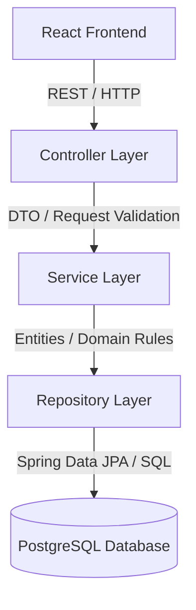
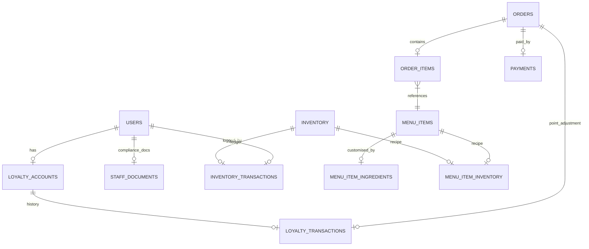

# Software Design Document (SDD) — BKB System

## Document Control
| Version | Date | Author | Description | Standard |
|---|---|---|---|---|
| v1.0.0 | 2026-06-14 | Antigravity AI | Initial system design mapping. | IEEE Std 1016-1998 |

---

## 1. Introduction

### 1.1 Purpose
This Software Design Document (SDD) describes the system architecture, component contracts, database entity-relationship models, and security structures for the Bukan Kedai Burger (BKB) platform.

### 1.2 Scope
The BKB platform consists of:
* A mobile-responsive frontend React 18 application.
* A Java 17 / Spring Boot 3.x backend exposing stateless APIs.
* A relational PostgreSQL database schema.
* Reverse proxy mapping configs (Nginx).

---

## 2. Architectural Design

### 2.1 Architecture Style
The BKB backend adheres to the **Layered Architecture Style (Controller-Service-Repository)** pattern, which isolates concerns and separates core business calculations from request formats or storage engines.



* **Controller Layer**: Exposes REST interfaces, validates incoming payloads (`@Valid`), maps routes, and handles authorization annotations (`@PreAuthorize`).
* **Service Layer**: Implements business calculations, inventory allocations, points rewards, and transactional boundaries (`@Transactional`).
* **Repository Layer**: Extends `JpaRepository` interface to perform database CRUD operations, index lookups, and transaction executions.

### 2.2 System Architecture Diagram

This diagram maps the structural flow of BKB's components in production:

```mermaid
graph TB
    User[Web Client Browser]
    
    subgraph Host_Nginx [Host Nginx Reverse Proxy (Port 80/443)]
        Proxy[Proxy Router]
    end
    
    subgraph Docker_Compose [Docker Compose Virtual Network]
        FE[Frontend Container: Nginx serving React Assets on Port 5173/80]
        BE[Backend Container: Spring Boot Application on Port 8081]
    end
    
    subgraph Storage [Database Tier]
        PG[(PostgreSQL Server: Port 5432)]
    end
    
    User -->|HTTPS Request| Proxy
    Proxy -->|Route '/'| FE
    Proxy -->|Route '/api'| BE
    BE -->|Spring JDBC / Hikari CP| PG
```

---

## 3. Component Design

### 3.1 Authentication Component
* **Purpose**: Manages system users, issue access tokens, and invalidate sessions.
* **Responsibilities**: Password verification, token parsing, and token blacklisting.
* **Dependencies**: `User`, `InvalidatedToken`, `BCryptPasswordEncoder`, `JwtAuthFilter`.

### 3.2 Category & Menu Component
* **Purpose**: Governs categories and food item listings.
* **Responsibilities**: Menu retrieval (filtered for active status for customers, unfiltered for staff), category ordering, and custom recipe mapping.
* **Dependencies**: `MenuItem`, `Category`, `MenuItemInventory` (composite PK recipe mapper).

### 3.3 Customization & Outages Component
* **Purpose**: Tracks custom ingredient quantities and availability.
* **Responsibilities**: Checks ingredient stock status before checkout; deactivates unavailable customization options.
* **Dependencies**: `MenuItemIngredient`, `IngredientOutage`.

### 3.4 Order Processing Component
* **Purpose**: Processes orders and governs kitchen state transitions.
* **Responsibilities**: Generates unique order numbers, calculates SST (6%), checks store operational status, and adjusts inventory levels on order completion.
* **Dependencies**: `Order`, `OrderItem`, `InventoryService`.

### 3.5 Payment Component
* **Purpose**: Tracks transaction status.
* **Responsibilities**: Cash override mapping, payment token creation for online transactions, and online callback simulation.
* **Dependencies**: `Payment`, `OrderRepository`.

### 3.6 Loyalty & Gaming Component
* **Purpose**: Gamifies customer interactions.
* **Responsibilities**: Point calculation (RM10 spent = 1 point), game score verification, in-memory double-claims prevention, and points redemption.
* **Dependencies**: `LoyaltyAccount`, `LoyaltyReward`, `LoyaltyTransaction`, `GameController`.

### 3.7 Inventory Ledger Component
* **Purpose**: Audits raw material counts.
* **Responsibilities**: Records waste volumes, processes stock adjustments, and automatically updates stock alerts via triggers.
* **Dependencies**: `Inventory`, `InventoryTransaction`.

### 3.8 Staff Document Component
* **Purpose**: Oversees hygiene and health compliance records.
* **Responsibilities**: Tracks Typhoid vaccination card validity and Food Handler certificate expiry.
* **Dependencies**: `StaffDocument`.

---

## 4. Database Design

### 4.1 ERD Diagram



### 4.2 Tables
The database consists of 14 primary tables. Details are defined in the next document ([DATABASE.md](file:///C:/Users/yusri/.gemini/antigravity-ide/brain/4fc3f90e-94a9-4b1b-bd91-67823afa5d39/DATABASE.md)).

---

## 5. API Design
REST API patterns are designed in OpenAPI structure inside ([API.md](file:///C:/Users/yusri/.gemini/antigravity-ide/brain/4fc3f90e-94a9-4b1b-bd91-67823afa5d39/API.md)).

---

## 6. Frontend Design

### 6.1 Pages
* `LandingPage.tsx`: Marketing landing page.
* `MenuPage.tsx`: Interactive catalog showing categorized menu items. Out-of-stock items are automatically greyed out.
* `CartPage.tsx` & `CheckoutPage.tsx`: Local storage backed cart system allowing ingredient level changes. Pickup scheduling page with cash/online toggles.
* `OrderTrackingPage.tsx`: Live state indicator tracking order stages. Displays canvas-based mini-game while order status is preparation.
* `LoyaltyPage.tsx`: Points overview, transaction lists, and reward vouchers.
* `KitchenPage.tsx`: Real-time dashboard for kitchen workers. Contains active orders sorted by PENDING/ACCEPTED/READY stages.
* `ManagerDashboard.tsx` & subpages: Admin pages showing inventory tables, waste forms, staff details, typhoid expiration trackers, and CSV export utilities.

### 6.2 State Management
* Uses native React hooks (`useState`, `useEffect`, `useContext`) to store user sessions and token maps locally.
* Context providers broadcast authentication states.
* API communication logic is isolated inside helper files under the `services` directory.

---

## 7. Security Design

### 7.1 Authentication Flow
```
Client                      JwtAuthFilter                  Controller/Service
  |                               |                                |
  |-- POST /api/auth/login ------>|                                |
  |   (Verify credentials)        |                                |
  |<-- Return access/refresh -----|                                |
  |                               |                                |
  |-- Call with Bearer Token ---->|                                |
  |                               |-- Validate Token ------------->|
  |                               |   (If valid, set security context)
  |                               |<-- Proceed with request -------|
```

### 7.2 Authorization Design
Enforced using Java method-level security `@PreAuthorize` tags:
* Roles hierarchy: `ROLE_ADMIN > ROLE_MANAGER > ROLE_STAFF > ROLE_CUSTOMER > ROLE_GUEST`.
* Spring Security auto-resolves parent-child role privileges. E.g., `hasRole('STAFF')` evaluates as true for accounts holding `ROLE_MANAGER` or `ROLE_ADMIN`.

### 7.3 Token Management
* **Access Token**: Short-lived payload (15 min) signed with HS256 JWT key.
* **Refresh Token**: Long-lived payload (7 days) saved securely in client storage, used to request a new access token without login operations.
* **Logout Blacklist**: Invalidates active sessions by inserting tokens into the `invalidated_tokens` table.

---

## 8. Deployment Design
The deployment configuration is structured for a single-server setup using Docker Compose to host containers, proxying requests through a host-level Nginx server configured with Let's Encrypt SSL/TLS certificates.

Refer to the ([DEPLOYMENT.md](file:///C:/Users/yusri/.gemini/antigravity-ide/brain/4fc3f90e-94a9-4b1b-bd91-67823afa5d39/DEPLOYMENT.md)) file for environment variables and backup guides.

---

## 9. Error Handling Design
* **Validation Errors**: Payload errors (empty strings, invalid emails, negative prices) return HTTP 400 with field-specific error messages.
* **Domain Errors**: Domain validations (store closed, out-of-points, double game claims) raise a `BkbException` returning HTTP 400 containing message wraps.
* **Not Found Errors**: Database lookup errors throw a `ResourceNotFoundException` returning HTTP 404.

---

## 10. Logging Design
* **Log Levels**: Configured to `INFO` for production, suppressing database queries, and `DEBUG` for local development.
* **Actuator monitoring**: Exposes `/actuator/health` and `/actuator/metrics` endpoints.
* **Audit Trails**: Security override logs are saved to the `security_logs` table, storing user roles, previous values, new values, and client IP addresses.
