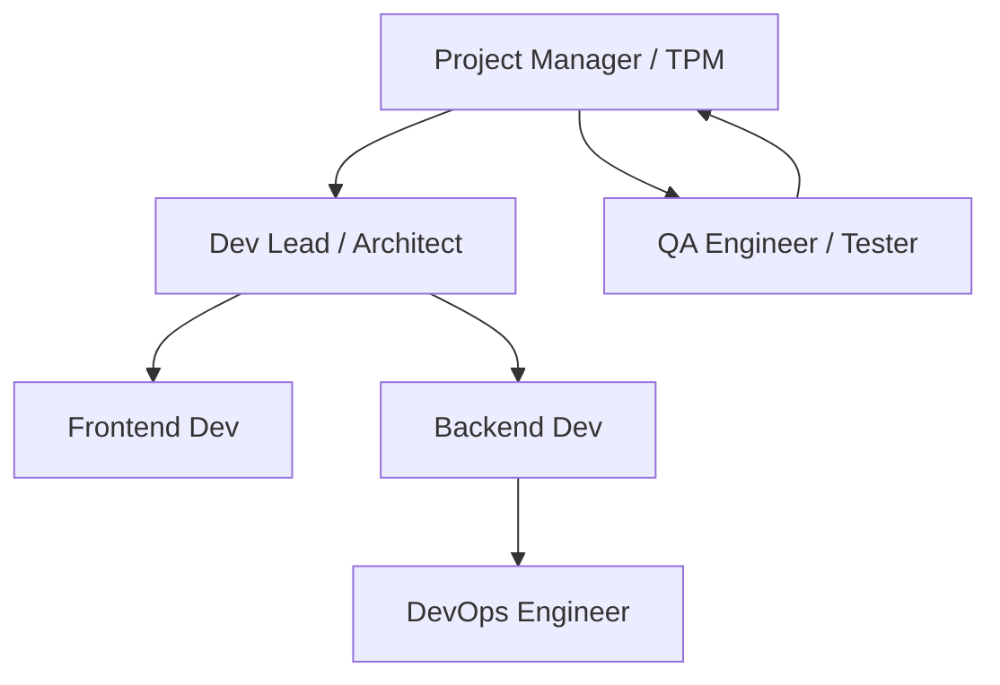
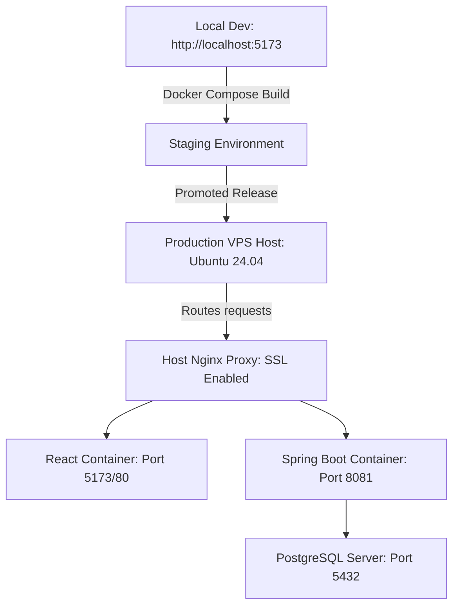

# Software Project Management Plan (SPMP) — BKB System

## Document Control
| Version | Date | Author | Description | Standard |
|---|---|---|---|---|
| v1.0.0 | 2026-06-14 | Antigravity AI | Initial project plan alignment. | IEEE Std 1058-1998 |

---

## 1. Introduction

### 1.1 Purpose
This Software Project Management Plan (SPMP) details the lifecycle management, team structure, resource allocation, and risk control measures for the Bukan Kedai Burger (BKB) order management platform. This document aligns project goals with development methodologies to guide execution and production handover.

### 1.2 Scope
The BKB system covers the development of a React 18 single-page application, a Spring Boot 3.x REST API, and a PostgreSQL 16/17 schema managed via Flyway. The scope is restricted to:
* Customer and Guest ordering workflows.
* Real-time kitchen dashboard status transitions.
* In-store inventory and waste logging.
* Compliance reporting (typhoid vaccination and food handler certificates).
* Security audit trails.
* FPX online payment simulation.

### 1.3 Objectives
* **Timeline Compliance**: Deliver full-stack features within 3 dev sprints.
* **Security & Auditability**: Ensure all manual overrides (such as cash confirmations and point adjustments) log previous/new states.
* **Continuous Deployability**: Build and start system environments using a single `docker compose up --build` command.

---

## 2. Project Organization

### 2.1 Team Structure
Based on standard software development lifecycle (SDLC) setups and the implementation files, the project maps to the following organizational model:



* **Project Manager (PM) / TPM**: Leads weekly alignment, tracks project status, maintains stakeholder approvals, and manages compliance deadlines.
* **Lead Developer / Architect**: Designs REST endpoints, drafts db schemas (`V1` to `V14`), manages Spring Security role hierarchy, and enforces clean architecture.
* **Frontend Developer**: Implements UI using React 18 + TS + Tailwind CSS. Configures pages like `MenuPage.tsx` and `KitchenPage.tsx`, and state variables.
* **Backend Developer**: Implements Java 17 + Spring Boot services, Flyway migration files, JWT auth filters, and repository logic.
* **QA Engineer / Tester**: Performs unit and integration testing. Validates API contracts against schema parameters and checks user role access logic.
* **DevOps Engineer**: Configures Docker, sets up the Nginx reverse proxy configs (`nginx.vps.conf`), schedules token cleanup crons, and manages SSL/TLS certificates.

---

## 3. Management Process

### 3.1 Development Methodology
The BKB project utilizes an **Agile/Scrum** methodology to handle feature releases iteratively.
* **Sprints**: 2-week iterations.
* **Daily Standups**: Focus on blockers, specifically backend integrations or state sync issues between React and Spring Boot.
* **Backlog Grooming**: Reviewing menu items, inventory trigger testing, and payment stubs refinements.

### 3.2 Project Lifecycle
The project steps follow the iterative lifecycle framework:

```
+------------+     +------------+     +-------------+     +------------+     +-------------+
|  Planning  | --> |   Design   | --> | Development | --> |  Testing   | --> | Deployment  |
|  (PRD/DB)  |     |  (ERD/API) |     |  (Coding)   |     | (Unit/UAT) |     | (Compose/Nginx)
+------------+     +------------+     +-------------+     +------------+     +-------------+
```

1. **Planning**: Requirements gathering, drafting tables, and checking regional rules (e.g., Malaysia SST rates and typhoid card validation).
2. **Design**: Creating database relationships (Composite keys in `menu_item_inventory`) and API schemas.
3. **Development**: Writing code in backend (Spring Boot) and frontend (React). Database scripts are saved in incremental Flyway files (`V1` through `V14`).
4. **Testing**: Running JUnit tests, testing endpoint role guards (`@PreAuthorize`), and validating Vite builds.
5. **Deployment**: Hosting the PostgreSQL database, configuring environment variables (`.env`), setting up Nginx, and registering Let's Encrypt SSL.
6. **Maintenance**: Monitoring logs (`/api/staff/security-logs`), running database backups, and cleaning up blacklisted JWTs every 10 minutes.

---

## 4. Risk Management

The project identifies several critical risks across different operational layers:

| Risk ID | Risk Area | Description | Probability | Impact | Mitigation Strategy |
|---|---|---|---|---|---|
| **R-001** | Security | In-memory mini-game points farming (tokens are not persisted). | Medium | High | Move score claiming to check actual orders and restrict claiming to once per order via database table constraint. |
| **R-002** | Technical | Database pool exhaustion due to slow queries during peak orders. | Low | High | Set Hikari max-pool-size to 20, implement indexes on `order_number`, `user_id`, and `created_at`. |
| **R-003** | Compliance| Staff working with expired typhoid vaccination cards. | Medium | High | Dashboard alerts when dates in `staff_documents` are within 30 days of expiry. |
| **R-004** | Security | Compromise of JWT signing key due to default/weak secret keys. | Low | High | Enforce env parameter checks on startup. Throw error if secret length is less than 256 bits in production. |
| **R-005** | Infrastructure | Intermittent connectivity to external payment gateways. | High | Medium | Simulators verify fallback status check endpoints (`GET /api/payments/{id}/status`) to poll status if callbacks fail. |

---

## 5. Resource Management

### 5.1 Hardware Requirements
* **Development Workstations**: 8GB RAM minimum (16GB recommended to run both IDE, Java JVM, Node, and Docker simultaneously).
* **Target VPS Host**: Ubuntu 24.04 LTS instance, 2 vCPUs, 2GB RAM minimum, 20GB SSD storage.

### 5.2 Software Requirements
* **Operating Systems**: Windows/macOS/Linux for development; Ubuntu Linux for production hosting.
* **Database**: PostgreSQL 16/17 Database Server.
* **Reverse Proxy**: Nginx 1.24+.

### 5.3 Development Tools
* **Languages**: Java 17, TypeScript (ES6+).
* **Frameworks**: Spring Boot 3.x, React 18, Tailwind CSS.
* **Build Systems**: Apache Maven 3.9+, Vite 5.x.
* **Containerization**: Docker 25+, Docker Compose 2.20+.

---

## 6. Configuration Management

### 6.1 Git Strategy
The development team uses a Git Branching model to maintain code quality and delivery structure:
* **`main`**: Production-ready branch. Direct commits are restricted. All code enters via pull requests.
* **`dev`**: Integration branch for daily development.
* **Feature Branches (`feat/...`, `fix/...`)**: Developers build individual modules here and merge into `dev` via peer-approved Pull Requests.

### 6.2 Release Process
1. Complete integration in `dev`.
2. Run testing suite (check compile, types, and unit tests).
3. Increment version in `pom.xml` and `package.json`.
4. Merge `dev` to `main`.
5. Docker Compose build is initiated (`docker compose build --no-cache`).
6. Apply database schemas via Flyway automatically upon backend startup.

---

## 7. Quality Management

### 7.1 Code Reviews
All merges to `dev` or `main` branches require:
* At least one approval from the Lead Developer/Architect.
* Passing automated build checks (no compiler errors, no lint issues, passing tests).
* Verification that database updates are isolated in a new Flyway migration file.

### 7.2 Testing Strategy
The QA model applies three layers of verification:
* **Unit Testing**: Testing Spring Boot repositories and custom validator beans.
* **Integration Testing**: Testing controller endpoint security using `@WebMvcTest` and mock JWT injection.
* **Manual Verification (UAT)**: Testing customer order tracking workflows, kitchen order status updates, and point adjustments in the browser.

---

## 8. Communication Plan
* **Weekly Project Status Report**: PM distributes progress reports listing tasks completed, in progress, and planned.
* **Change Control**: Major changes (like schema modifications or third-party payment integrations) require a formal RFC (Request for Comments) and approval by the Lead Architect.

---

## 9. Deployment Plan



* **Development Environment**: Local environment run using `mvnw spring-boot:run` and `npm run dev`. Configured via Local PostgreSQL.
* **Staging Environment**: Runs on a local Docker engine using the standard `docker-compose.yml` to verify container configurations.
* **Production Environment**: Ubuntu 24.04 VPS with host PostgreSQL. Traffic is managed via Host Nginx reverse proxy (Port 80/443 SSL) proxying to Docker containers.

---

## 10. Glossary
* **systemd**: Linux system service manager used to manage the Native Backend runner execution block.
* **Certbot**: Automated client that fetches and installs SSL certificates from Let's Encrypt.
* **SST**: Sales and Services Tax in Malaysia.

---

## 11. Assumptions
* **Assumption - Requires Stakeholder Confirmation**: It is assumed that the production deployment will target a single VPS. If horizontal auto-scaling is required in the future, the session management and game de-duplication must be rewritten using Redis or a shared DB table.
