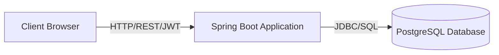

# Software Requirements Specification (SRS) — BKB System

## Document Control
| Version | Date | Author | Description | Standard |
|---|---|---|---|---|
| v1.0.0 | 2026-06-14 | Antigravity AI | Initial requirements baseline. | IEEE Std 830-1998 |

---

## 1. Introduction

### 1.1 Purpose
This Software Requirements Specification (SRS) defines the functional, non-functional, and interface requirements for the Bukan Kedai Burger (BKB) platform. This document is intended for project developers, testers, system auditors, and final handover reviewers.

### 1.2 Scope
This specification covers the full-stack BKB software system, consisting of the Spring Boot REST API backend, the Vite React frontend, and the Flyway-managed PostgreSQL database. Key modules include Auth, Menu and Ingredient Outage Management, Order Customization and Processing, Loyalty and Gamification, Inventory Ledger, and Staff Health Card Compliance tracking.

### 1.3 Definitions
* **JWT**: JSON Web Token. A stateless token used to secure REST operations.
* **Token Invalidating**: The process of adding a logged-out token to the database blacklist table until its natural expiration.
* **Typhoid Card**: A mandatory vaccination certificate in Malaysia for food handlers.
* **Food Handler Certificate**: A mandatory certification in Malaysia for food preparation workers.

### 1.4 References
1. *IEEE Std 830-1998, IEEE Recommended Practice for Software Requirements Specifications.*
2. BKB Codebase Configurations (`application.yml`, `SecurityConfig.java`, Flyway SQL files).

---

## 2. Overall Description

### 2.1 Product Perspective
The BKB system utilizes a decoupled client-server architecture. The frontend React single-page application runs in the user's browser, making asynchronous API requests to the Spring Boot REST backend. The backend manages state via a PostgreSQL database.



### 2.2 Product Functions
* Authentication & Sessions (Self-registration, Login, JWT verification, and Guest Sessions).
* Store Control (Toggle order placement availability).
* Interactive Menu & Outages (Dynamic listing, Category filters, and ingredient availability toggling).
* Real-time Kitchen Tracking (Preparation state shifts: accepted, grilling, assembling, ready, completed).
* Gamified Loyalty Program (Burger Stack game, automatic points calculation, rewards redemption).
* Inventory Audit Logs (Automatic stock levels via DB trigger, waste records, and adjustments).
* Compliance Tracking (Staff typhoid records, food handler expiration dates).
* Audit Trails (Sensitive action logs tracking IP addresses and user roles).

### 2.3 User Classes
* **GUEST (Anonymous Customer)**: Can view menu items and place cash/online orders.
* **CUSTOMER (Registered Customer)**: Inherits Guest capabilities. Can also view loyalty balances, play the stack game to earn points, and redeem rewards.
* **STAFF (Kitchen & Counter operators)**: Can manage orders, toggle menu/ingredient outages, adjust stock levels, and log waste transactions.
* **MANAGER**: Inherits Staff capabilities. Can manage menu listings, edit categories, view sales dashboards, configure loyalty rewards, add new staff, and edit compliance document dates.
* **ADMIN (System Owner)**: Inherits Manager capabilities. Can manage system accounts, edit user roles, delete accounts, manually override loyalty point balances, and review security logs.

### 2.4 Operating Environment
* **Client Runtime**: Modern web browsers supporting ES6 (Chrome, Firefox, Safari, Edge).
* **Server JVM**: Java Runtime Environment (JRE) 17 or higher.
* **Database engine**: PostgreSQL 16 or 17.
* **Container runtime**: Docker engine with Docker Compose support.

### 2.5 Constraints
* **Token Lifespan**: JWT access tokens are hardcoded to expire in 15 minutes, requiring refresh tokens to maintain active sessions.
* **Memory Limits**: The mini-game de-duplication utilizes an in-memory Java concurrent set, meaning points claiming limits resets if the backend instance restarts.
* **SST Hardcoding**: The sales service tax rate is set to 6% (`0.06`) inside the `application.yml` properties file.

---

## 3. Functional Requirements

### FR-001: User Authentication & Profiles
* **Description**: Allows users to register, log in, create guest sessions, refresh tokens, log out, and manage profile configurations.
* **Inputs**: Register requests (name, email, phone, password), Login requests (email, password), Guest requests (name, phone), update requests.
* **Outputs**: JWT access/refresh tokens, status code, profile JSON.
* **Processing Logic**:
  * Passwords must be hashed using BCrypt.
  * Logout retrieves the token from the HTTP Authorization header and saves it to the `invalidated_tokens` table.
* **Validation Rules**:
  * Email must be unique. Password must meet strength rules.

### FR-002: Store Operations Toggle
* **Description**: Sets the global state variable allowing or denying checkout actions.
* **Inputs**: Boolean value (`open`: true/false).
* **Outputs**: Updated store status.
* **Processing Logic**:
  * Saves the current value to a static variable.
  * Writes a security log capturing the user, previous state, new state, and IP address.
* **Validation Rules**: Requires `MANAGER` or `ADMIN` roles.

### FR-003: Menu & Ingredient Outage Controls
* **Description**: Displays the menu card and lets staff deactivate items or flag out-of-stock ingredients.
* **Inputs**: Menu item fields, ingredient outage toggle requests.
* **Outputs**: Available menu listings, updated outages.
* **Processing Logic**:
  * Customers receive only active, non-deleted items.
  * Staff can toggle the `out_of_stock` parameter on individual ingredients.
* **Validation Rules**: Outage updates require `STAFF` role or higher. Menu writes require `MANAGER` role.

### FR-004: Order Processing & Status Flow
* **Description**: Manages order checkout, pickup scheduling, and preparation workflow status updates.
* **Inputs**: `PlaceOrderRequest` (items, customizations, payment method, pickup time, notes), `UpdateOrderStatusRequest`.
* **Outputs**: Created order details, updated status logs.
* **Processing Logic**:
  * Checks store status. If closed, throws exception.
  * Deducts inventory stock based on the recipe link (`menu_item_inventory`) if configured.
  * Status steps: `PENDING` -> `ACCEPTED` -> `GRILLING` -> `ASSEMBLING` -> `READY` -> `COMPLETED`.
* **Validation Rules**: Status updates are restricted to `STAFF` role or higher.

### FR-005: Burger Stack Mini-Game
* **Description**: Score submission for the waiting area mini-game.
* **Inputs**: `orderId`, `score`.
* **Outputs**: Points awarded status, message.
* **Processing Logic**:
  * Verifies order belongs to the user.
  * Checks that no reward has been claimed yet for the user/order session.
  * Converts score: `points = Math.min(20, score / 100)`.
  * Adjusts customer loyalty account points.
* **Validation Rules**: Restriced to `CUSTOMER` role. Only one claim per order allowed.

### FR-006: Cash & Online Payments
* **Description**: Records counter cash payments or validates simulated online payments.
* **Inputs**: Order ID, online gateway reference.
* **Outputs**: Saved payment record, paid status.
* **Processing Logic**:
  * Cash payments must be manually confirmed by counter staff.
  * Online payments generate a secure URL with `payment_token`. If lookup is made on an online order without the token, throws security exception.
* **Validation Rules**: Cash override updates require `STAFF` role or higher.

### FR-007: Loyalty Accounts & Rewards
* **Description**: Grants points for orders and manages point redemptions.
* **Inputs**: Order totals, reward ID.
* **Outputs**: Point balance updates, reward order items.
* **Processing Logic**:
  * Earning: Adds `subtotal / 10` points to the user's loyalty account.
  * Redemption: Deducts `points_cost` from the customer's balance. Inserts reward menu item into current transaction.
* **Validation Rules**: Balance cannot be negative. Point adjustments require `ADMIN` role.

### FR-008: Inventory & Waste Ledger
* **Description**: Tracks raw ingredients levels, stock transactions, and waste records.
* **Inputs**: Adjustment requests (quantity, type, reason).
* **Outputs**: Stock ledger, transaction lists.
* **Processing Logic**:
  * Stock updates automatically trigger status evaluations (`GOOD`, `LOW`, `CRITICAL`) inside the DB.
  * Waste logs record type `WASTE` and deduct stock.
* **Validation Rules**: Stock adjustments require `STAFF` role or higher. Creating inventory items requires `MANAGER` role.

### FR-009: Staff Compliance & Documents
* **Description**: Tracks safety documents for staff members.
* **Inputs**: Typhoid vaccine expiry date, food handler certificate expiry, contact information.
* **Outputs**: compliance status reports.
* **Processing Logic**:
  * Document metadata is saved in `staff_documents` table linked to user account.
* **Validation Rules**: Restricted to `MANAGER` or `ADMIN` roles.

### FR-010: Security Log Auditing
* **Description**: Records administrative overrides.
* **Inputs**: Target action context, user agent, IP header.
* **Outputs**: Paged list of audit logs.
* **Processing Logic**:
  * Logs user email, action name, details, previous value, new value, IP address, and creation date.
  * Restricts log viewing to the `ADMIN` role.
* **Validation Rules**: Log viewing is restricted to the `ADMIN` role.

---

## 4. Non-Functional Requirements

### 4.1 Performance
* **Response Time**: All GET API requests must load in under 100ms. Write endpoints (checkout, updates) must compile in under 300ms.
* **Throughput**: System handles 50 concurrent ordering sessions without degradation in pool resources.

### 4.2 Security
* **Access Control**: Role hierarchy is configured: `ADMIN > MANAGER > STAFF > CUSTOMER > GUEST`.
* **Password Security**: Managed via Spring Security BCrypt hashing with work factor strength 12.
* **Session Invalidations**: Token cleanup scheduler cleans up blacklisted sessions every 10 minutes from memory.

### 4.3 Availability
* **Uptime**: Designed for 99.9% availability.
* **Health Checks**: Actuator endpoint `/actuator/health` exposes DB and system health.

### 4.4 Scalability
* **REST Statelessness**: JWT sessions remove the need for server memory checks, allowing standard horizontal scaling.

### 4.5 Reliability
* **Data Persistence**: Foreign key delete cascades ensure referential integrity (e.g. deleting menu item cascades to customization configurations).

### 4.6 Maintainability
* **Schema Evolution**: Flyway migrations run on startup, verifying sql structures against schema hash maps.

---

## 5. External Interface Requirements

### 5.1 User Interface
The UI comprises three distinct spaces:
1. **Customer View**: Responsive mobile-first ordering app. Pages include the menu selection page, cart/checkout options, payment simulator window, and the order status tracker with the canvas-based mini-game.
2. **Kitchen Dashboard**: Single-page tracking UI with card grids sorted by preparation states, showing burger customizations in large text and audio alerts when new orders arrive.
3. **Manager Panel**: Side-navigation layout containing inventory grids, waste forms, staff details, typhoid calendar checks, sales charts, and CSV export utilities.

### 5.2 API Interfaces
All endpoints return standard wrapper JSON (`ApiResponse` structure):
```json
{
  "success": true,
  "message": "Operation successful",
  "data": { ... }
}
```

* **Authentication Endpoint**:
  * `POST /api/auth/login`
  * Request: `{ "email": "staff@bkb.com", "password": "..." }`
  * Response: `{ "success": true, "data": { "accessToken": "...", "refreshToken": "...", "role": "STAFF" } }`

* **Order Verification Endpoint**:
  * `GET /api/orders/ref/{ref}?token={paymentToken}`
  * Returns secure order details for payment callbacks.

### 5.3 Database Interfaces
* JDBC connection using Hikari Connection Pool.
* Schema consists of 16 tables, with constraints and indices managed through PostgreSQL database schemas. Relationships follow standard primary-to-foreign-key constraints.
* Triggers: `trg_inventory_status` executing function `update_inventory_status()` checks stock updates automatically.
