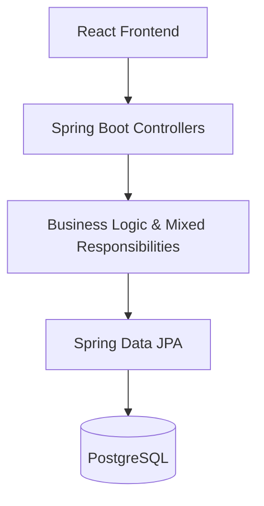

# 12. Architecture Diagram (Current vs Proposed)

## Current Architecture
The current architecture follows a monolithic pattern with some blurring of boundaries between Controller and Service layers. The frontend is a monolithic React bundle.



## Proposed Architecture
The proposed architecture enforces strict MVC, modular frontend design, and focused domain services.

```mermaid
graph TD
    subgraph Frontend [React SPA]
        Pages[Pages & Routing]
        Shared[Shared App Design System]
        State[Zustand State Management]
        Pages --> Shared
        Pages --> State
    end

    subgraph Backend [Spring Boot]
        Controllers[Controllers (Routing & Validation)]
        Domain[Domain Services (Strict Business Logic)]
        Auth[Auth / Security Services]
        Repos[Repositories]
        
        Controllers --> Domain
        Controllers --> Auth
        Domain --> Repos
    end

    Frontend -->|REST / JSON| Controllers
    Repos --> DB[(PostgreSQL)]
```

## Key Changes
- Extraction of a **Shared App Design System** on the frontend.
- Strict isolation of **Controllers** and **Domain Services** on the backend.
- Splitting of large monolithic services into focused domain handlers.
